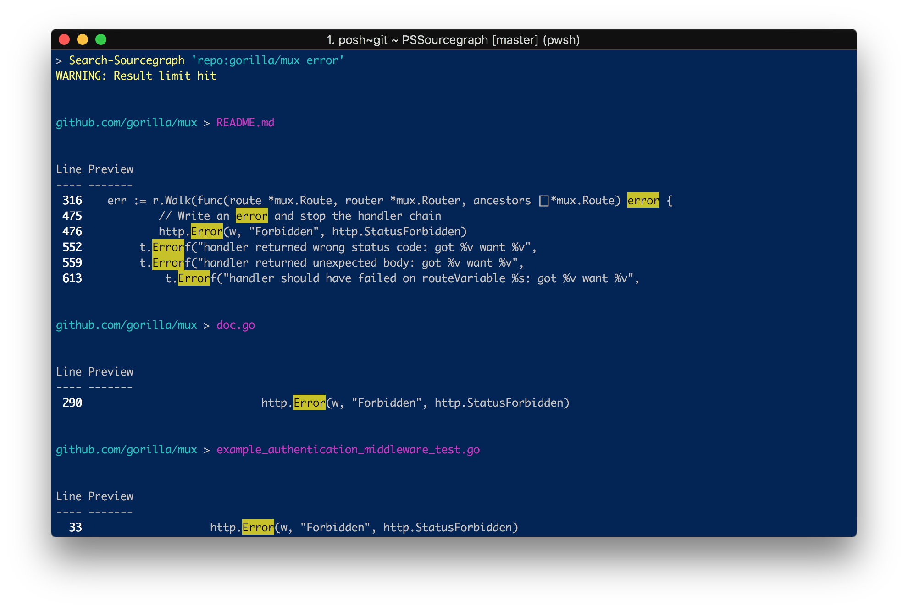
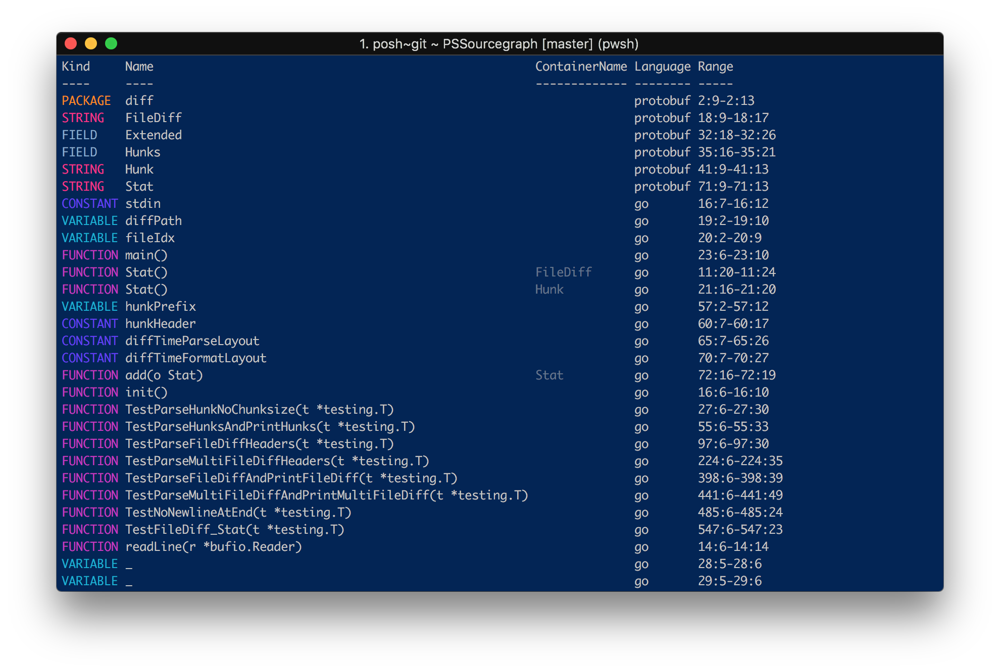

# Sourcegraph for PowerShell

[](https://www.powershellgallery.com/packages/PSSourcegraph)
[](https://www.powershellgallery.com/packages/PSSourcegraph)
[](https://travis-ci.org/sourcegraph/PSSourcegraph)


Search Sourcegraph from PowerShell





Pretty formatting is supported for text, file and symbol results (`type:file` and `type:symbol`)

## Installation

```powershell
Install-Module PSSourcegraph
```

## Included

Use `Get-Help` to see documentation for any command.

- **Search**
  - `Search-Sourcegraph` 💡 _with query autocompletion_
- **Code intelligence**
  💡 _all code intelligence cmdlets support search output as pipeline input_
  - `Get-SourcegraphHover` 💡 _displayed as rendered markdown_
  - `Get-SourcegraphDefinition`
  - `Get-SourcegraphReference` 💡 _automatically paginated and streamed_
- **Repositories**
  - `Get-SourcegraphRepository`
- **Users**
  - `Get-SourcegraphUser`
  - `New-SourcegraphUser`
- **Utility**
  - `Invoke-SourcegraphApiRequest`

Missing something? Please file an issue!

## Alias

By default, all commands are prefixed with `Sourcegraph` like shown above.
If you prefer a shorter prefix, e.g. `Src` or `Sg`, you can import the module under a different prefix in your `$PROFILE`:

```powershell
Import-Module PSSourcegraph -Prefix Src
```

The commands are then available under that prefix, e.g. `Search-Src` or `Get-SrcHover`.

## Configuration

You can use a private instance by passing an instance URL with the `-Endpoint` parameter and an API token with the `-Token` parameter to any command.
The token must be a `SecureString` for security.
To configure a default endpoint and token to use, modify `$PSDefaultParameterValues` in your `$PROFILE`:

### On Windows

```powershell
$PSDefaultParameterValues['*Sourcegraph*:Endpoint'] = 'https://sourcegraph.example.com'
$PSDefaultParameterValues['*Sourcegraph*:Token'] = 'YOUR_ENCRYPTED_TOKEN' | ConvertTo-SecureString
```

To get the value for `YOUR_ENCRYPTED_TOKEN`, run `Read-Host -AsSecureString | ConvertFrom-SecureString` once
and paste in your token.

### On macOS/Linux

macOS and Linux do not have access to the Windows Data Protection API, so they cannot use
`ConvertFrom-SecureString` to generate an encrypted plaintext version of the token without a custom encryption
key.

If you are not concerned about storing the token in plain text in the `profile.ps1`, you can set it like this:

```powershell
$PSDefaultParameterValues['*Sourcegraph*:Endpoint'] = 'https://sourcegraph.example.com'
$PSDefaultParameterValues['*Sourcegraph*:Token'] = 'YOUR_PLAINTEXT_TOKEN' | ConvertTo-SecureString -AsPlainText -Force
```

Alternatively, you could store the token in a password manager or the Keychain, then retrieve it in your
profile and set it the same way.
